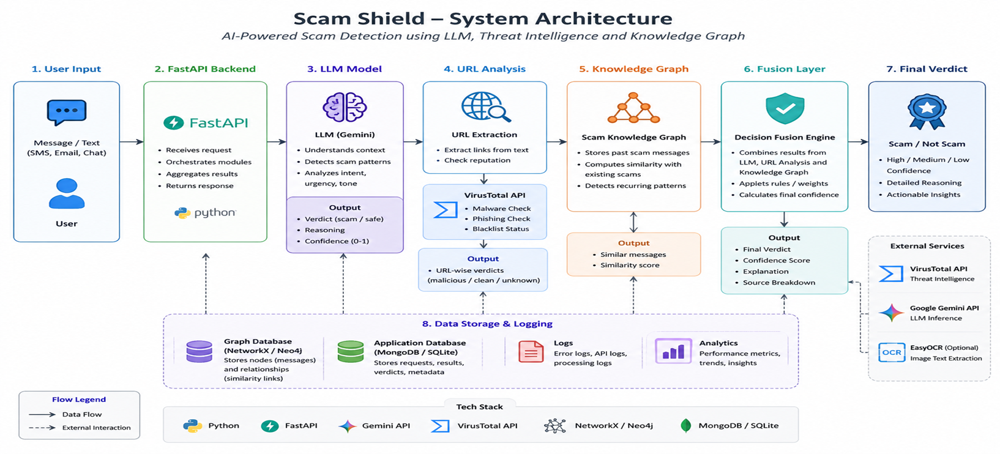

# SCAM SHIELD

Scam Shield is an AI-powered scam detection system that classifies suspicious messages (SMS, Email, WhatsApp) into SCAM or SAFE, explains the reasoning, and stores scam data for analytics.  
It combines ML models, LLM reasoning, threat intelligence APIs, and a knowledge graph to deliver robust scam detection.

---

## Features
- Multi-layer detection: ML + LLM + Threat Intelligence + Graph similarity
- Confidence scoring: Fusion layer combines signals into a percentage score
- LLM reasoning: Explains why a message is scam/safe
- Database integration: Stores scam messages with category, source, and confidence
- Frontend UI: Clean web interface with verdict color indicators
- Threat APIs: VirusTotal integrated, extensible for AbuseIPDB, Google Safe Browsing, PhishTank, etc.
- Knowledge Graph: Links similar scam messages for pattern analysis

---

## Project Structure

```
Scam_Shield/
│── backend/
│   ├── main.py                # FastAPI backend entrypoint
│   ├── llm/gemini_client.py   # LLM classification (Google Gemini API)
│   ├── llm/prompts.py         # Prompt templates
│   ├── threat_intel/          # Threat intelligence clients (VirusTotal, etc.)
│   ├── graph/                 # ScamGraph + similarity engine
│   ├── db/                    # CRUD operations for MySQL
│   └── ml_models.py           # ML-based classification
│
│── frontend/
│   ├── index.html             # Web UI
│   ├── style.css              # Styling
│   └── script.js              # Frontend logic (verdict colors, confidence %)
│
│── requirements.txt           # Python dependencies
│── README.md                  # Documentation


```


---
## ARCHITECTURE


---

## Getting Started

### 1. Clone the Repository
```bash
git clone https://github.com/<vardhanrajt6-pixel>/Scam_Shield.git
cd Scam_Shield
```

### 2. Backend Setup
Install dependencies:

pip install -r requirements.txt
Configure environment variables in backend/config.py:

GOOGLE_API_KEY → Gemini API key

MODEL_PATH → Gemini model path (e.g., gemini-1.5-flash)

VT_API_KEY → VirusTotal API key

Database credentials (MySQL)

Run backend:

uvicorn backend.main:app --reload
Backend will start at:
http://127.0.0.1:8000

### 3. Frontend Setup
Open frontend/index.html in your browser.

The UI lets you:

Select message type (SMS, Email, WhatsApp)

Paste suspicious message

Get Verdict, Confidence %, Reasoning

See verdict color-coded: SCAM (red), SAFE (green)

### 4. Database Tracking
Scam messages are stored in MySQL with:

message

verdict

confidence (integer %)

category (phishing, lottery, job scam, etc.)

source_type (sms/email/whatsapp)

created_at

Check stored scams:
```sql
USE scam_shield;
SELECT * FROM scam_messages;
```
### 5. Threat Intelligence Expansion
Currently integrated:

     VirusTotal (URL reputation)

Possible additions:

     AbuseIPDB (IP reputation)

     Google Safe Browsing (phishing/malware URLs)

     PhishTank (phishing database)

     Have I Been Pwned (email breach check)

     Hybrid Analysis (file sandbox)

Each API can be added as a new client in backend/threat_intel/ and fused in main.py.

### 6. Fusion Confidence Logic
Base confidence from LLM (30%)

ML model contribution (40%)

VirusTotal flags (+15%)

Graph similarity (+15%)


### 7. Example Workflow
User pastes message:

Your bank account has been locked. Verify here: http://secure-login.fake
Backend runs ML + LLM + Threat APIs + Graph.

Fusion result:

```json
{
  "final_verdict": "scam",
  "confidence": 85,
  "reasoning": "Suspicious URL requesting login details",
  "category": "phishing"
}
```
Frontend shows:

Final Verdict: SCAM (red)
Confidence: 85%
Reasoning: Suspicious URL requesting login details

### 8. Contributing
Fork the repo

Create feature branches (feature/add-google-safe-browsing)

Submit PRs with clear descriptions

### 9. License
MIT License — free to use, modify, and distribute.
